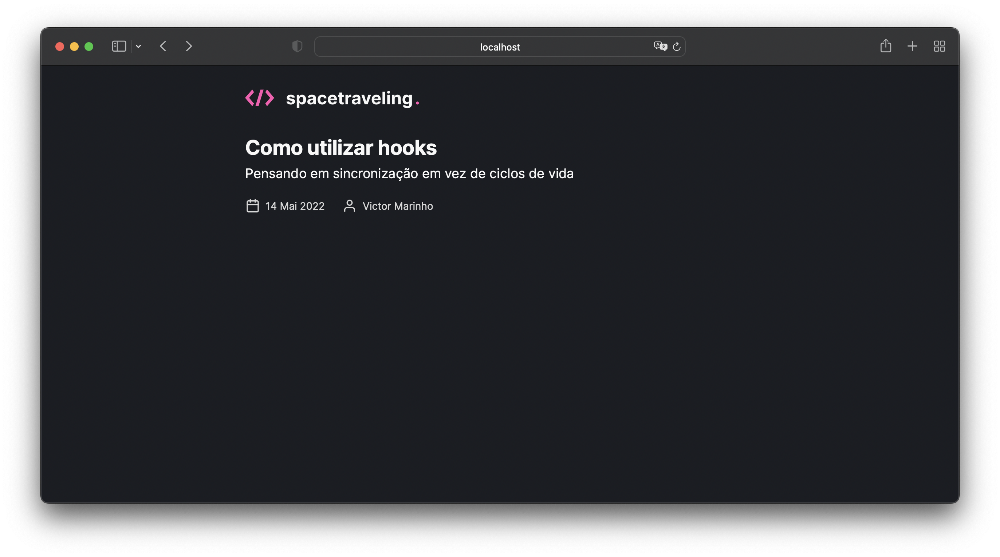
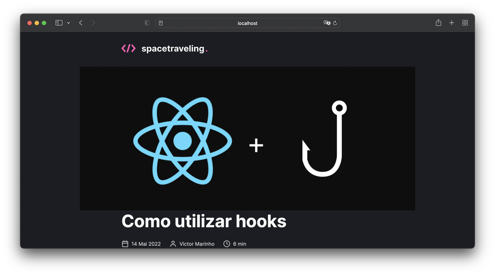

# Space Traveling

## 📚 Informações sobre o projeto

- Esse blog foi um projeto desenvolvido durante um desafio do Ignite da Rocketseat! A ideia era desenvolver do 0 uma aplicação, desde o front-end até a conexão com o Prismic CMS para a publicação dos posts.

## 💻 O que tem no projeto?

- Front-end bem clean, desenvolvido seguindo o proposto no [Figma](https://www.figma.com/file/0Y26j0tf1K2WB5c1ja5hov/Desafios-M%C3%B3dulo-3-ReactJS?node-id=0%3A1).
- Integração com o Prismic CMS, para trabalhar com toda a parte do sistema do blog.
- Integração com o sistema de Preview do Prismic, onde é possível ver um post não publicado dentro do blog, antes mesmo dele ir ao ar.
- Uso do sistema estático do Next.js, onde os posts são mantidos no cache para um melhor carregamento.
- Sistema de comentários usando o Utteranc.

## 🛠️ Tecnologias/Ferramentas ultilizadas

- [React](https://pt-br.reactjs.org/E)
- [Next.js](https://nextjs.org/)
- [Prismic CMS](https://prismic.io/)
- [Utteranc](https://utteranc.es/)

Feito com 💙 por Victor Marinho

